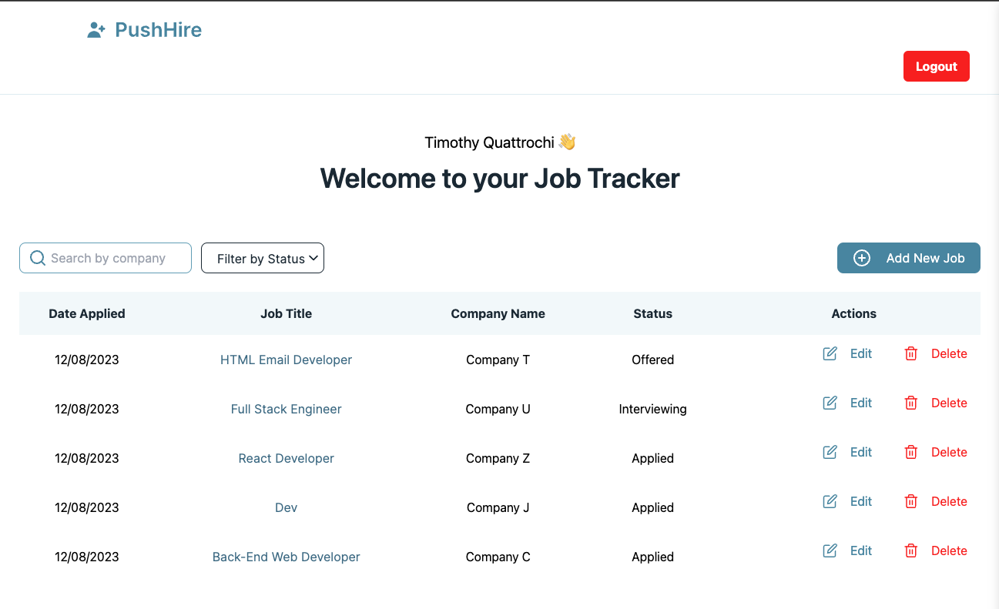
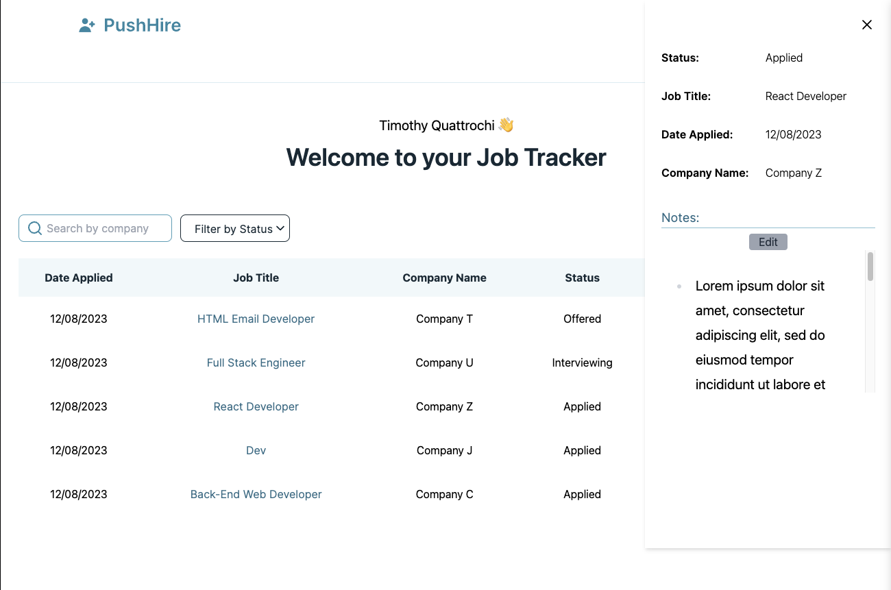
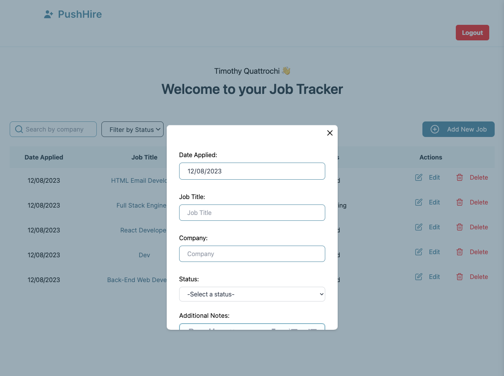

# PushHire Job Tracker





## Description
This is a job tracker application that allows users to create an account, add jobs to their profile, and track the status of their job applications. Users can also add notes to each job application to keep track of important information. Working on making a chrome extension that will allow users to add jobs to their profile directly from the job posting as another feature of this application.
## Table of Contents
* [Installation](#installation)
* [Usage](#usage)
* [Evironment Variables](#evironment-variables)
* [Tech](#tech)
* [Contributions](#contributions)

## Installation
To install necessary dependencies, run the following command from the ROOT directory of this project:

```
npm install
```

## Usage
To use this application, run the following command from the ROOT directory of this project:

```
npm run dev
```

Start the dev server by changing directories into server and running:

```
npm run dev
```
## Evironment Variables

I have included env.examples in the root and server directories for reference. You will need to create your own .env files in both the root and server directories. You will need to create a database in MySQL and add your database name, username, and password to the .env file in the server directory. 


## Tech

### **Front-End**
- [Tailwind CSS] - A utility-first CSS framework for rapidly building custom designs.
- [react] - A JavaScript library for building user interfaces.
- [Vite] - A build tool that aims to provide a faster and leaner development experience for modern web projects.
- [RTK] - A powerful, opinionated Redux toolset for writing reducers, thunks, and more.
- [RTK Query] - A powerful data fetching and caching tool.


### **Back-End**

- [Express] - A minimal and flexible Node.js web application framework that provides a robust set of features for web and mobile applications.
- [Node.js] - A JavaScript runtime built on Chrome's V8 JavaScript engine.
- [MySQL] - A relational database management system based on SQL – Structured Query Language, the most popular language for adding, accessing, and managing the content in a database.

## Contributions
Find a bug?
I welcome contributions. Simply open a pull request with your changes and I will review them.


[tailwind css]: https://tailwindcss.com/docs/guides/vite
[RTK]: https://redux-toolkit.js.org/
[RTK Query]: https://redux-toolkit.js.org/rtk-query/overview
[vite]: https://vitejs.dev/
[mongoose]: https://mongoosejs.com/
[mysql]: https://www.npmjs.com/package/mysql
[node.js]: http://nodejs.org
[express]: http://expressjs.com
[react]: https://react.dev/
